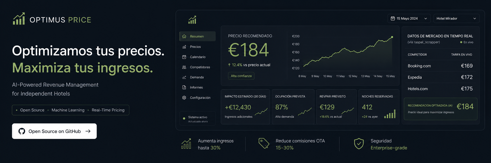

<p align="center">
  
</p>

<p align="center">
  <b>Hotel Pricing Predictor — Research Prototype</b><br>
  ML-powered price prediction · Historical data analysis · Interpretable models
</p>

<p align="center">
  
  
  
  
</p>

---

## V1 — FROZEN (Research Prototype)

**V1 is frozen. No further development.** Historical Kaggle baseline only.

| Metric | Value |
|--------|-------|
| **Champion Model** | ElasticNet (alpha=0.024, l1_ratio=0.725) |
| **Scaler** | None (NoScaler) |
| **R²** | 0.3594 |
| **RMSE** | 31.48 |
| **MAE** | 24.22 |
| **MAPE** | 23.87% |
| **Gap R²** | 0.004 (no overfitting) |
| **Features** | 27 raw (no engineering) |
| **Dataset** | 117,429 bookings (Kaggle, Portugal) |
| **Maturity** | Research Prototype |

### Why NoScaler?

| Scaler | Test RMSE | R² | Gap R² |
|--------|:---------:|:--:|:------:|
| **NoScaler** | **31.48** | **0.359** | **0.004** |
| StandardScaler | 31.63 | 0.353 | 0.009 |
| RobustScaler | 31.68 | 0.351 | 0.011 |
| MinMaxScaler | 32.21 | 0.329 | 0.004 |

### Why Feature Engineering Failed

| Approach | RMSE | R² | Gap R² |
|----------|:----:|:--:|:------:|
| 27 raw features | **31.48** | **0.359** | **0.004** |
| + 19 engineered features | 31.95 | 0.340 | 0.213 |
| + 9 INE Baleares features | 34.22 | 0.243 | 0.306 |

**Root cause**: The Kaggle dataset has limited signal. All 27 raw features already capture the available information optimally. Engineered features add redundant noise. INE Baleares data is for a different geography (Portugal vs Spain).

### Overfitting Analysis

| Model | Train R² | Test R² | Gap R² | Verdict |
|-------|:--------:|:-------:|:------:|---------|
| ElasticNet | 0.362 | 0.359 | 0.004 | ✅ No overfitting |
| GradientBoosting | 0.832 | 0.135 | 0.697 | 🔴 Severe |

---

## V2 — Market Intelligence (IN PROGRESS)

**Strategy**: Multi-fuente (INE primary, Google Trends proxy, user data)

| Component | Status |
|-----------|--------|
| Data model | ✅ Complete (market_index, price_bands, demand_signals, seasonality_index) |
| INE Ingester | ✅ Complete |
| Google Trends Ingester | ✅ Complete |
| Market Context Provider | ✅ Complete |
| V2 Tests | ✅ 10/10 passing |
| INE Baleares data | ✅ Downloaded (occupancy, prices 1998-2026) |
| Real data ingestion | 🔄 Pending |
| V2 Dashboard | ❌ Rejected — needs rebuild |
| OTA Scraping | ❌ Abandoned (JS SPA + anti-bot) |

**V2 needs real Baleares hotel price data to leverage INE occupancy data.**

---

## Architecture

```
src/optimus_price/             V1 — FROZEN
  training.py                  ElasticNet + NoScaler
  feature_builder.py           Feature engineering (NOT USED in V1)
  prediction_service.py        V1 + optional V2 context
  time_series_enricher.py      Seasonal decomposition (Phase 3)

src/v2_pipeline/               V2 — IN PROGRESS
  market_db.py                 4-table schema
  ine_ingester.py              INE CSV parser
  gtrends_ingester.py          Google Trends parser
  market_context.py            V2 context for V1
```

---

## Quick Start (V1 Frozen)

```bash
git clone https://github.com/juandelaf1/OptimusPrice.git
cd Optimus_Price_Final
pip install -r requirements.txt

# Train model (V1 frozen)
python -m src.optimus_price.training

# Run V1 dashboard
streamlit run app_streamlit/app_cliente.py
```

---

## Documentation

| Document | Status |
|----------|--------|
| `AGENTS.md` | **V1 Frozen** |
| `roadmap.md` | **V1 Frozen** |
| `docs/V2_REALITY_ASSESSMENT.md` | V2 audit |
| `docs/V2_DATA_MODEL_REDESIGN.md` | V2 data model |
| `docs/V2_SOURCE_STRATEGY.md` | Multi-fuente strategy |

---

<p align="center">
  <sub>Version 1.0 — V1 Frozen. June 2026</sub>
</p>